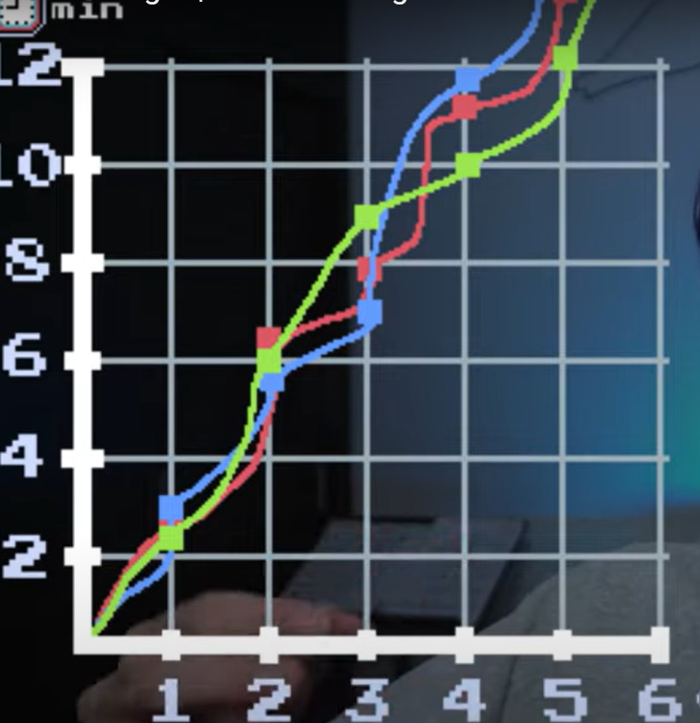

Complejidada de Tiempo
![alt text][def]
    Ejemplo llevar un libro
[def]: image.png
    Notacion Asintotica

El big(o) es un notacion Asintotica
    No son tan buenas las normales en la vida real, no son exactas 
    En el peor de los casos es el big(o)., como se comporta nuestro algoritmo, segun la entrada.

big(1)->
    